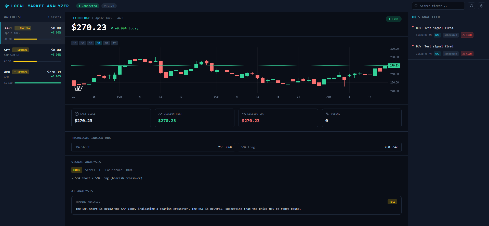

# Local Market Analyzer

A local-first AI-powered market analysis terminal. Configure watchlists and technical indicators, then send your analysis to any LLM you choose — Ollama, llama.cpp, vLLM, or any OpenAI-compatible endpoint — and get back natural language summaries and signal recommendations in real time. Everything runs on your machine.

  

> **Disclaimer:** This project is for educational and research purposes only. It does not constitute financial advice, investment advice, trading advice, or any other type of advice. The signals, scores, and LLM-generated summaries produced by this software are the output of rule-based heuristics and language models — they are not predictions of future price movements. Do not make any financial or investment decisions based on the output of this software. Always do your own research and consult a qualified financial professional before trading.

---

<!-- Add a screenshot here once you have one:

To add a screenshot: create a docs/ folder, add the image, commit it,
then replace the line above with the correct filename.
-->



## Features

- **Real-time symbol analysis** — fetches OHLCV data via yfinance, computes SMA, RSI, MACD, and Bollinger Bands
- **Pluggable LLM** — works with Ollama, llama.cpp, vLLM, LM Studio, or any OpenAI-compatible API
- **Custom prompt templates** — write your own YAML prompts and assign different prompts to different watchlist groups
- **Live signal feed** — SSE stream pushes results to the UI instantly as the scheduler completes each cycle
- **Watchlist groups** — multiple named groups, each with independent symbols, intervals, indicators, and prompts
- **Fully local** — no cloud dependency except yfinance market data fetches

## Quick Start

```bash
# 1. Clone & install
git clone https://github.com/your-username/local-market-analyzer
cd local-market-analyzer
make install          # creates backend venv + installs frontend npm deps

# 2. Configure
cd backend/config
cp settings.example.yaml settings.yaml
cp prompts.example.yaml prompts.yaml
# Edit settings.yaml to set your LLM endpoint and watchlist

# 3. Start
make dev              # backend on :8000, frontend on :5173
```

Open [http://localhost:5173](http://localhost:5173) in your browser.

## Configuration

All configuration lives in two YAML files under `backend/config/`. Neither file is committed to git — copy from the provided examples.

```
backend/config/
  settings.example.yaml  ← committed template
  settings.yaml          ← your config (gitignored)
  prompts.example.yaml   ← committed prompt templates
  prompts.yaml           ← your prompts (gitignored)
```

### LLM Setup (`settings.yaml`)

```yaml
llm:
  provider: openai_compat        # or: llamacpp
  base_url: http://localhost:11434/v1   # Ollama default
  model: llama3                  # required for openai_compat
  temperature: 0.2
  max_tokens: 2048
  timeout: 120
```

**Ollama (recommended for local):**
```bash
# Install Ollama: https://ollama.com
ollama pull llama3
ollama serve     # starts on :11434
```

**llama.cpp server:**
```yaml
llm:
  provider: llamacpp
  base_url: http://localhost:8080
```

**Any OpenAI-compatible API** (vLLM, LM Studio, OpenRouter):
```yaml
llm:
  provider: openai_compat
  base_url: https://api.example.com/v1
  model: your-model-name
```

> API keys belong in `backend/.env` only — never in `settings.yaml`:
> ```
> LLM_API_KEY=your-key
> ```

### Watchlist Groups (`settings.yaml`)

Each watchlist entry defines a named group of symbols with its own scan interval, indicators, and prompts:

```yaml
watchlist:
  - name: Tech Momentum
    enabled: true
    symbols: [AAPL, MSFT, NVDA, TSLA]
    interval_minutes: 60      # scan every 60 minutes
    include_llm: true
    prompts:
      - file: prompts          # refers to backend/config/prompts.yaml
        name: trading_analysis
    indicators:
      sma:
        short_period: 20
        long_period: 50
      rsi:
        enabled: true
        period: 14
        oversold: 30
        overbought: 70
      macd:
        enabled: false
        fast: 12
        slow: 26
        signal: 9
      bb:
        enabled: false
        period: 20
        std: 2
```

**Interval options** (most granular wins):

| Field | Meaning |
|---|---|
| `interval_seconds` | Poll every N seconds (useful for fast testing) |
| `interval_minutes` | Poll every N minutes |
| `interval_hours` | Poll every N hours |
| `interval_days` | Poll every N days |

**Indicators:** `sma` is always computed. `rsi`, `macd`, and `bb` are opt-in via `enabled: true`. Only enabled indicators are shown in the UI and included in LLM prompts.

Watchlist changes are hot-reloaded — no restart needed.

### Prompt Templates (`prompts.yaml`)

Prompts control exactly what the LLM sees for each analysis. Each prompt has a `system` message and a `user` message with `{variable}` substitution:

```yaml
prompts:
  trading_analysis:
    system: |
      You are a technical analysis assistant for a research tool.
      Respond ONLY with a raw JSON object with keys "summary" and "recommendation".
      "recommendation" must be BUY, SELL, or HOLD.
    user: |
      Symbol: {symbol}
      Price: ${close}
      Indicators:
      {indicators_text}
      Rule-based signal: {signal} (score={score}, confidence={confidence})
      Reasons:
      {reasons}
      Respond with ONLY the JSON object.
```

**Available variables:**

| Variable | Description |
|---|---|
| `{symbol}` | Ticker symbol (e.g. AAPL) |
| `{close}` | Latest close price |
| `{indicators_text}` | Auto-formatted block of computed indicator values |
| `{signal}` | Rule-based signal: BUY / SELL / HOLD |
| `{score}` | Raw integer score from the signal engine |
| `{confidence}` | Confidence ratio 0–1 |
| `{reasons}` | Bullet-point list of signal reasons |

**Custom prompts:** Add a new key under `prompts:` in `prompts.yaml` (or create a separate YAML file), then reference it in `settings.yaml`:

```yaml
prompts:
  - file: prompts        # filename without .yaml extension
    name: my_prompt
```

The UI reads the available prompt list from the backend automatically — new prompts appear in the Config panel without a restart.

## Architecture

```
frontend/          → React + Vite + Tailwind (terminal-style UI)
backend/
  config/          → settings.yaml + prompts.yaml (gitignored; copy from *.example.yaml)
  app/
    api/           → FastAPI routes (REST + SSE endpoints)
    core/          → Config, domain models, interfaces
    services/      → Market data (yfinance), signal engine, scheduler
    graph/         → LangGraph workflows (features → signals → LLM)
    llm/           → Pluggable LLM adapters (OpenAI-compat, llama.cpp)
    prompts/       → Default prompt loader
```

## API Endpoints

| Method | Path | Description |
|--------|------|-------------|
| `GET` | `/health` | Health check |
| `GET` | `/api/market/price/{symbol}` | Latest price for a symbol |
| `GET` | `/api/market/watchlist` | Prices + signals for configured symbols |
| `POST` | `/api/analysis` | Full analysis pipeline (indicators + signal + optional LLM) |
| `POST` | `/api/analysis/batch` | Analyze multiple symbols |
| `GET` | `/api/analysis/scheduled` | Latest results from background scheduler |
| `GET` | `/api/analysis/stream` | SSE stream — real-time scheduler results |
| `GET` | `/api/config` | Read current config |
| `PUT` | `/api/config` | Update config |
| `GET` | `/api/config/prompts` | List available prompt names |
| `GET` | `/docs` | Interactive API docs (Swagger) |

### Example: Run analysis with LLM

```bash
curl -X POST http://localhost:8000/api/analysis \
  -H "Content-Type: application/json" \
  -d '{"symbol": "AAPL", "include_llm": true}'
```

## Make Targets

```
make install       Install backend venv + frontend npm deps
make dev           Run backend + frontend concurrently
make backend       Start FastAPI backend only (port 8000)
make frontend      Start Vite dev server only (port 5173)
make build         Build frontend for production
make lint          Lint backend (ruff) + frontend (eslint)
make clean         Remove build artifacts
```

## Screenshots

To add screenshots to this README:

1. Create a `docs/` folder in the repo root
2. Add your screenshot files (PNG or GIF recommended)
3. Commit them: `git add docs/ && git commit -m "docs: add screenshots"`
4. Reference them here:

```markdown

```

Or drag-and-drop an image into any GitHub issue comment box, copy the generated URL, and paste it here.

## Contributing

See [CONTRIBUTING.md](CONTRIBUTING.md) for setup instructions and contribution guidelines.

## License

[MIT](LICENSE)

